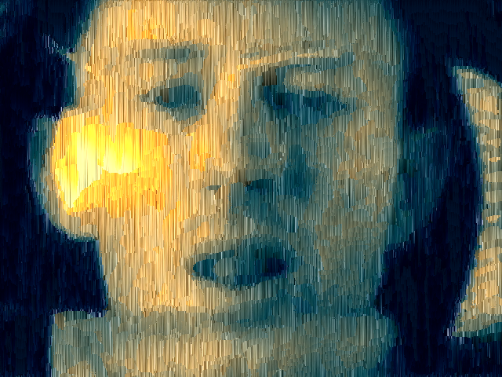
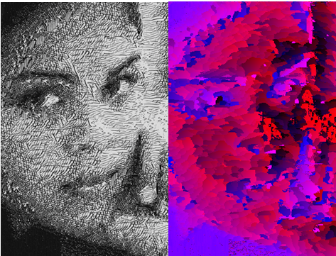

**University of Pennsylvania, CIS 660: Advanced Topics in Computer Graphics and Animation
Mini Minecraft Project**

* Josh Lawrence

**Overview** 
This was a group project with Grace Xu wherein we implemented a recent siggraph paper. 
The paper is here: https://graphics.pixar.com/library/ByExampleStylization/paper.pdf. We need to also implement other papers (Image Analogies, Patch Match) in order to implement this paper. 
Examples that follow are without temporal coherence since we were unable to obtain good enough quality optical flow from the Lucas-Kanade method or OpenCV. After talking with the author, odd things can happen if the optical flow is of poor quality, which makes the result look off in motion areas. The only libraries we used was Sean Barrett's stb-image libs. If temporal coherence is turned on we use OpenCV's calcOpticalFlowFarneback to obtain an image of optical flow values to advect results from one frame to another.

**Results** 
**Face** 

**Butterfly** 

**No Suprises Frames** 

**Anvil Frames** 

**Radiohead No Suprises Stylization** 
* [video link](https://vimeo.com/240189597)
* Low Quality GIF:

**Lorn Anvil Stylization** 
* [video link](https://vimeo.com/240189551)
* Low Quality GIF:

**Debug views** 
**Style Source locations** 

**Gaussian pyramid** 

**Per pixel gradients (dx2,dy2,dxdy)** 

**Per pixel neighborhood orientation** 

**Farneback Optic flow** 

**Original Repo if this doesnt work** 
https://bitbucket.org/loshjawrence/animationstylizer
